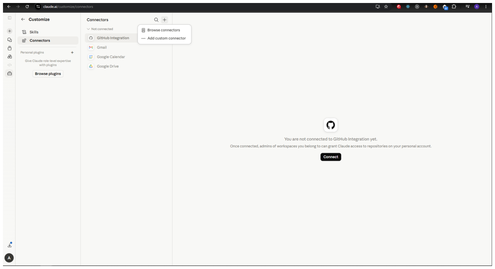
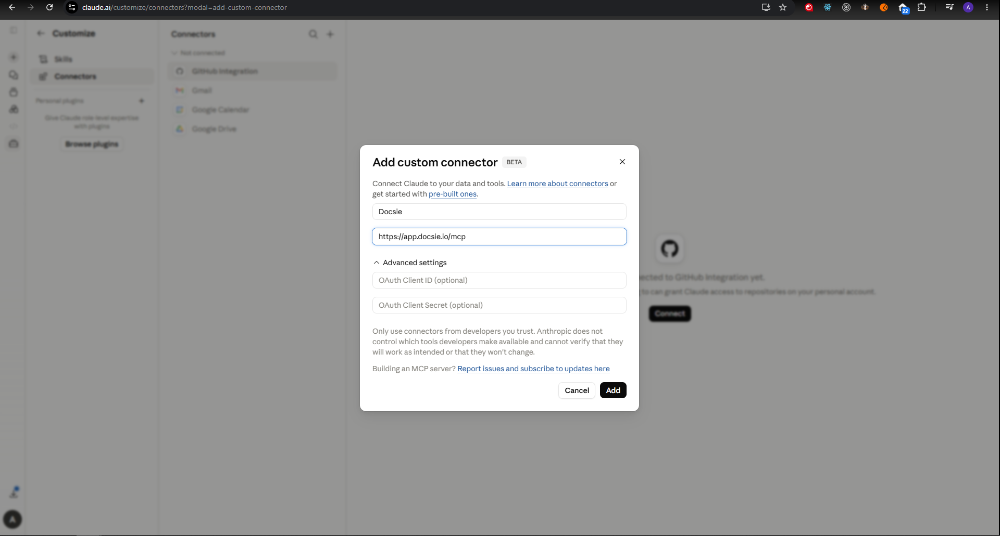
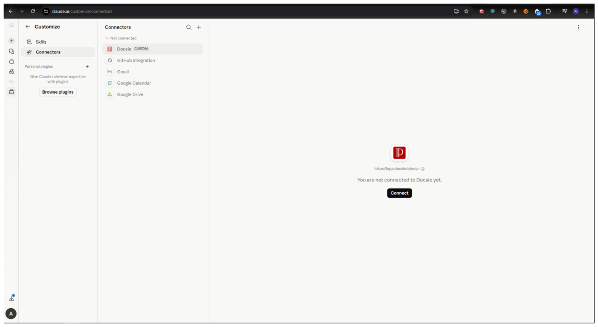
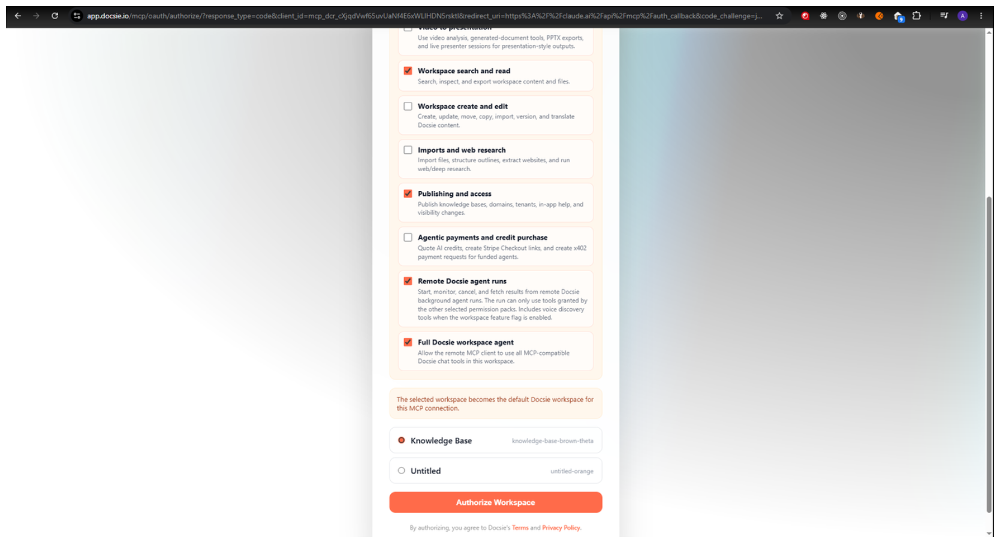
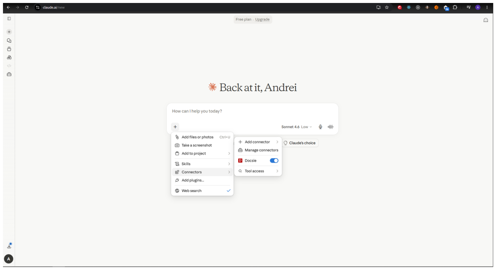
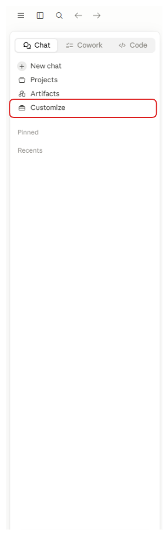
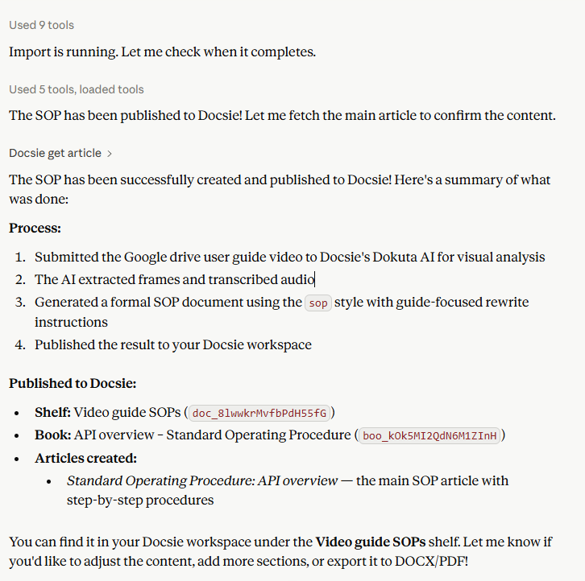

# Claude

## Remote Connector

Server URL:

```text
https://app.docsie.io/mcp
```

Expected flow:

1. Add Docsie MCP as a remote connector.
2. Complete Docsie OAuth.
3. Select organization, workspace, and permission packs.
4. Ask Claude to list Docsie tools or search Docsie.

## Test Prompts

```text
Search Docsie for release notes about the latest product update.
```

```text
Turn this video URL into step-by-step documentation: https://example.com/demo.mp4
```

## TODO(andrei)

- Add Claude listing URL.
- Add final submission/review status.
- Add screenshots of connect, OAuth, tool list, and video-to-docs run.
- Add known caveats for Claude.ai vs Claude Desktop vs Claude Code.

# Claude — Docsie MCP Setup Guide

This document covers verified setup instructions for connecting Docsie MCP to Claude across all supported Claude clients.

---

## 1. Claude.ai — Remote Connector Setup

### Step 1 — Open Connectors

1. Go to [https://claude.ai/customize/connectors](https://claude.ai/customize/connectors)

---

### Step 2 — Add MCP Server

1. Click **Add custom connector**

2. Enter the following server URL:

```
https://app.docsie.io/mcp
```

3. Give it a name, e.g. `Docsie`
4. Click **Add**



---

### Step 3 — OAuth Authentication

After adding the server, You should authenticate in Docsie:

1. Click **Connect** button

2. Log in with your Docsie credentials when prompted
3. Approve the requested permissions (`connections:execute`)

4. You will be redirected back to Claude.ai

---

### Step 4 — Verify Tools Are Visible

Once connected, verify Docsie tools are available:

1. Start a new conversation in Claude.ai
2. Click the **Plus** icon  in the chat bar
3. Hover over **Connectors** and you should see **Docsie** listed



---

## 2. Claude Desktop — Setup

### Step 1 - Open connectors

1. Click the Customize button in the left sidebar

2. Open Connectors here
3. Once you opened Connectors page proceed with Step 2 of Claude.ai — Remote Connector Setup


---

## Demo Flows

### Demo 1 — Search Documentation (`docsie_search`)

**Prompt:**
```
Search my Docsie workspace for articles about "API authentication"
```

**Tool chain:**
1. `search_articles` — searches across articles with query `API authentication`

**Expected response:**
Claude returns a list of matching articles with titles, summaries, and IDs. Example:

```
I found 3 articles matching "API authentication" in your workspace:

1. Getting Started with the Docsie API (ID: abc123)
   — Covers API key setup and basic authentication headers.

2. OAuth 2.0 Integration Guide (ID: def456)
   — Step-by-step guide for implementing OAuth with Docsie.

3. Securing Your API Endpoints (ID: ghi789)
   — Best practices for token management and rate limiting.

Would you like me to open any of these?
```


---

### Demo 2 — Video to Documentation Pipeline (`video_to_docs_submit` → `video_to_docs_status` → `video_to_docs_result`)

**Prompt:**
```
Generate documentation from this video: https://example.com/my-tutorial.mp4
```

**Tool chain:**

**Step 1 — Submit**
Tool: `video_to_docs_submit`
Input:
```json
{
  "video_url": "https://example.com/my-tutorial.mp4",
  "dokuta_annotations_enabled": true
}
```
Response: returns a `job_id`, e.g. `job_abc123`

**Step 2 — Poll Status**
Tool: `video_to_docs_status`
Input:
```json
{
  "job_id": "job_abc123"
}
```
Claude polls this every few seconds until `status` returns `completed`.

**Step 3 — Fetch Result**
Tool: `video_to_docs_result`
Input:
```json
{
  "job_id": "job_abc123"
}
```
Response: structured markdown documentation generated from the video content.

**Expected final response from Claude:**
```
Your documentation has been generated from the video. Here's what was created:

## My Tutorial — Generated Documentation

### Overview
[Generated introduction from video content]

### Step 1 — [Section title from video]
[Generated content...]

### Step 2 — [Section title from video]
[Generated content...]

Would you like me to publish this to your Docsie workspace?
```


---

## Known Caveats & Errors

### Tools not visible after connecting

**Symptom:** Docsie appears connected but no tools show in the tools panel.
**Fix:**
1. Disconnect and reconnect the integration
2. Hard refresh the page (`Cmd+Shift+R` / `Ctrl+Shift+R`)
3. Start a new conversation — tools sometimes only appear after a fresh session

---

### Long video processing times

**Note:** Video analysis and documentation generation can take several minutes for longer videos. Claude will poll status automatically but may appear idle during processing. This is expected behaviour.

