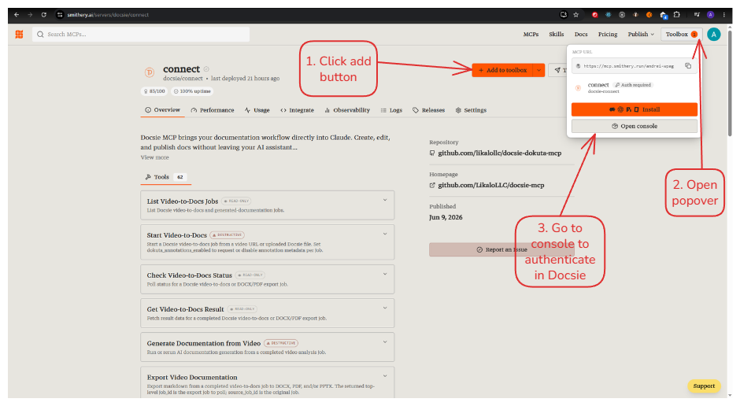
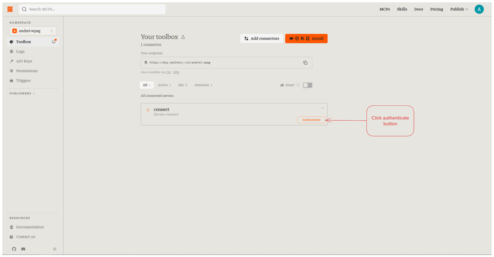
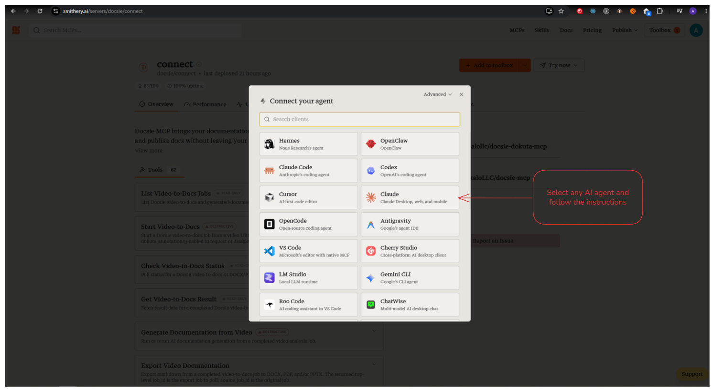

# Smithery

## Listing URL

https://smithery.ai/server/docsie-connect

---

## Listing Details

### Description

> Docsie MCP is a Model Context Protocol server that connects Claude and other AI assistants to your Docsie workspace. Generate long-form docs from videos or uploaded files; run compliance analysis on video, audio, and text; browse shelves, books, and articles; search documentation semantically;   and export content to DOCX or PDF — all from a single conversational prompt.

### Categories / Tags

- `documentation`
- `productivity`
- `video-to-docs`
- `knowledge-base`
- `compliance`

---

## Tool Count

62 tools across the following capability groups:

| Group | Tools |
|---|---|
| Video-to-Docs | `video_to_docs_submit`, `video_to_docs_status`, `video_to_docs_result`, `video_to_docs_generate`, `video_to_docs_export`, `video_to_docs_cancel`, `video_to_docs_estimate`, `video_to_docs_templates`, `video_to_docs_list`, `video_to_docs_export_generated`, `video_to_docs_export_status`, `video_to_docs_export_result` |
| Video Compare | `video_compare_submit`, `video_compare_status`, `video_compare_result`, `video_compare_cancel` |
| Video Analysis | `analyze_video_with_dokuta`, `check_video_status`, `fetch_advanced_video_annotations`, `refresh_video_content`, `generate_video_documentation`, `finalize_video_import`, `refresh_image_urls` |
| Documentation | `list_workspaces`, `list_shelves`, `list_books`, `list_articles`, `list_versions`, `list_languages`, `list_workspace_versions`, `list_workspace_languages`, `docsie_search`, `docsie_get_article`, `search_articles`, `search_documentation_semantic`, `get_article_raw`, `export_article_as_markdown` |
| Doc Generation | `generate_longform_documentation`, `short_doc_generation_async`, `generate_video_documentation`, `fill_docx_template` |
| Compliance | `analyze_video_compliance`, `analyze_audio_compliance`, `analyze_text_compliance`, `check_compliance_status`, `list_compliance_analyses` |
| Files | `list_files`, `get_file_info`, `generate_file_download_url`, `generate_upload_url`, `create_file_from_temp` |
| Voice | `voice_options`, `voice_speech` |
| Context & Utilities | `gather_context`, `get_workspace_overview`, `get_generated_documents`, `get_generated_document_section`, `retrieve_tool_result`, `compare_content`, `get_comparison`, `search_tools`, `find_agent_for_tools`, `validate_tool_plan` |

---

## Setup guide

### 1. Add mcp and go to authentification page

### 2. Authenticate

### 3. Install

### 4. Connect to AI agent

---

## TODO(andrei)

- Add Smithery public listing URL.
- Add setup/deployment URL if public.
- Add screenshots of successful registration and tool discovery.
- Add known OAuth redirect caveats.0

list_active_operations